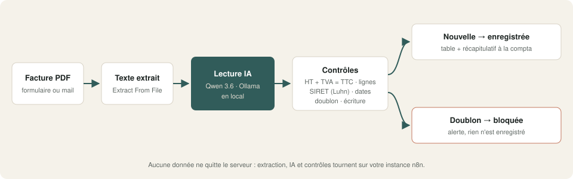
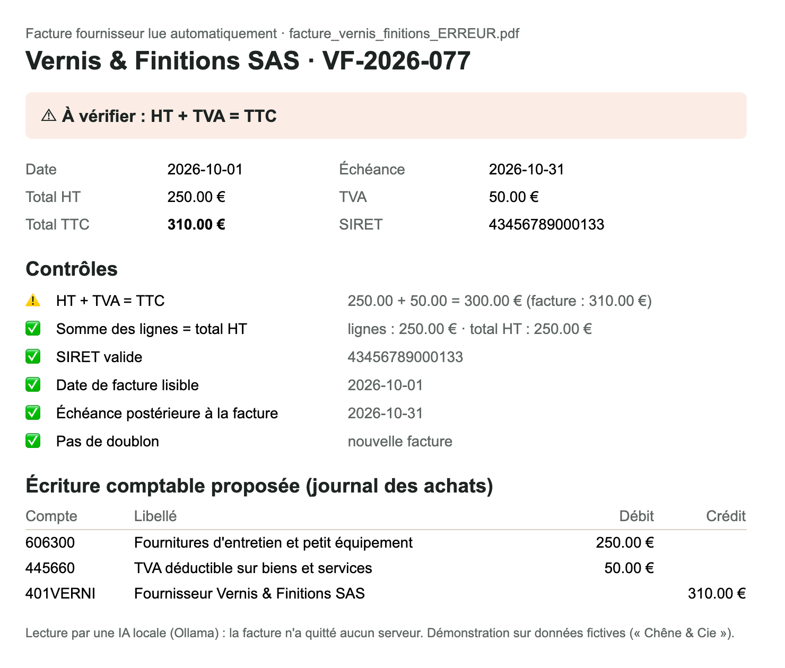

# 01 · Factures fournisseurs → lecture IA locale → comptabilité

Déposez une facture fournisseur en PDF. Une IA **qui tourne chez vous** en extrait les données, vérifie les montants, repère les doublons et propose l'écriture comptable. La comptabilité reçoit un récapitulatif clair.

## Ce que fait le workflow

1. **Réception** d'une facture PDF (formulaire dans la démo).
2. **Extraction du texte** du PDF.
3. **Lecture par IA locale** (Ollama, modèle Qwen 3.6) : fournisseur, SIRET, n° de TVA, numéro, dates, montants HT, TVA, TTC, IBAN, lignes, nature de la dépense.
4. **Contrôles automatiques** :
   - HT + TVA = TTC (à 2 centimes près) ;
   - somme des lignes = total HT ;
   - SIRET valide (clé de Luhn) ;
   - date lisible, échéance postérieure à la facture ;
   - **doublon** (même fournisseur, même numéro).
5. **Écriture comptable proposée** (journal des achats) : compte de charge selon la nature (601, 606, 607, 611, 622, 624…), TVA déductible 445660, compte fournisseur 401.
6. **Enregistrement** dans une table n8n si la facture est nouvelle, avec un statut : `prete` ou `a_verifier`.
7. **Récapitulatif** envoyé à la comptabilité ; un doublon est signalé et **n'est pas enregistré**.

## Résultat

Facture avec une erreur de total (TTC à 310 € au lieu de 300 €) : l'anomalie est signalée, l'écriture reste à valider.

## Testé

Sur les 4 factures fictives fournies (`factures_test/`, régénérables avec `node generer_factures_test.js`) :

| Facture | Résultat attendu | Résultat obtenu |
|---|---|---|
| Bois & Scierie du Limousin · 1 296 € TTC | prête | ✓ prête, compte 601000 |
| Quincaillerie Pro Ouest · 411 € TTC | prête | ✓ prête, compte 606300 |
| Vernis & Finitions SAS · TTC faux | à vérifier | ✓ anomalie « HT + TVA = TTC » |
| Bois & Scierie du Limousin (renvoyée) | doublon bloqué | ✓ signalée, non enregistrée |

Durée mesurée : **35 à 65 secondes par facture** avec le modèle 27B sur un Mac (Apple Silicon). Un modèle plus petit va plus vite, au prix d'une lecture un peu moins fiable.

## Prérequis

- **n8n 2.x** auto-hébergé (les Data Tables sont utilisées pour l'historique).
- **Ollama** avec un modèle de chat capable de sortie structurée : `qwen3.6` recommandé (un modèle 7–8B fonctionne pour des factures simples).
- Un serveur **SMTP** (Mailpit suffit pour tester).
- Factures **PDF avec texte** (les PDF générés par un logiciel de facturation). Les scans et photos sont gérés dans la version pro.

## Installation · environ 15 minutes

1. Importer `demo.json` dans n8n (*Import from file*).
2. Créer deux identifiants : `Ollama local` (API Ollama) et `SMTP Mailpit (démo)` (SMTP).
3. Dans le nœud du modèle, choisir votre modèle Ollama.
4. Dans les réglages du workflow, retirer ou renseigner le workflow d'erreur.
5. Publier le workflow, ouvrir l'URL du formulaire et déposer une facture de `factures_test/`.

## Limites de la démo

- Une facture à la fois, PDF texte uniquement.
- La table de catégories vers comptes est volontairement courte : adaptez-la à votre plan comptable.
- L'écriture est **proposée**, jamais passée seule : un humain valide.

## Version pro

La version complète ajoute :

- la boîte mail comme déclencheur (pièces jointes, plusieurs factures par mail) ;
- les **scans et photos** de factures (lecture par IA avec vision) ;
- les **factures électroniques Factur-X** (lecture du XML intégré, sans IA) ;
- l'export vers Pennylane, Axonaut ou un fichier d'écritures importable ;
- la reprise sur erreur et le signal de vie pour la supervision ;
- un guide d'installation en français et une vidéo.

---

Démonstration sur données fictives (« Chêne & Cie »). Licence [PolyForm Noncommercial 1.0.0](../../LICENSE.md).
