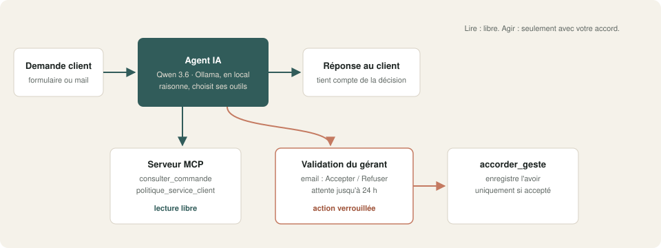
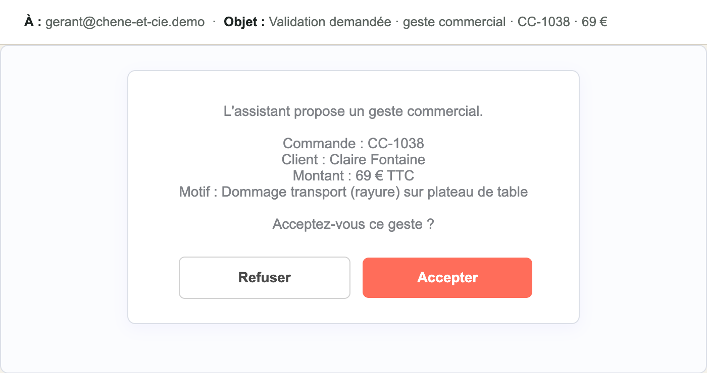
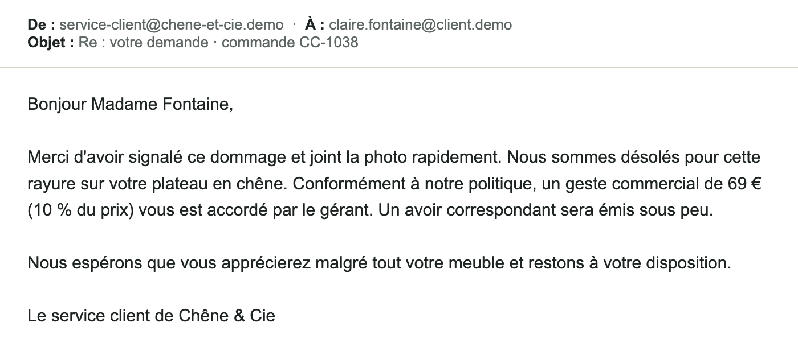

# 02 · Agent IA avec outils MCP et validation humaine

Un agent IA qui **lit librement** vos données et qui **n'agit qu'avec votre accord**. Ici, il répond aux demandes du service client d'un atelier de menuiserie : suivi de commande, dommage à la livraison, geste commercial.

## Ce que fait le workflow

Deux workflows travaillent ensemble.

**`demo_serveur_mcp.json` · le serveur d'outils MCP.** Il publie deux outils en lecture seule au format **MCP** (Model Context Protocol), le standard ouvert qui permet à un agent IA d'utiliser vos données (n8n, Claude, ChatGPT, Cursor…) :

- `consulter_commande` : détail d'une commande (articles, prix, statut, dates, suivi) ;
- `politique_service_client` : règles de retour, garantie, dommages, gestes autorisés.

L'accès est protégé par une clé (Bearer).

**`demo_agent.json` · l'agent du service client.**

1. Une demande client arrive (formulaire dans la démo).
2. L'agent, une **IA locale** (Ollama), consulte les outils MCP dont il a besoin.
3. S'il juge qu'un **geste commercial** est justifié, il calcule le montant selon la politique (de 5 à 15 % du prix de l'article) et appelle l'outil `accorder_geste_commercial`.
4. Cet outil est **verrouillé** : le gérant reçoit un email avec deux boutons, **Accepter** ou **Refuser**. L'exécution attend sa décision, jusqu'à 24 h.
5. **Accepté** : le geste est enregistré et annoncé au client. **Refusé** : rien n'est enregistré, et le client apprend qu'un conseiller revient vers lui.
6. La réponse part au client.

## Résultat

Le gérant reçoit la proposition de l'agent :

Après acceptation, le client reçoit :

## Testé

| Demande | Décision du gérant | Résultat |
|---|---|---|
| « Où en est ma commande ? » (CC-1042) | aucune demandée | ✓ statut et date d'expédition exacts, lus via MCP |
| Plateau rayé, 690 € (CC-1038) | acceptée | ✓ geste de 69 € (10 %) enregistré et annoncé |
| Étagère abîmée, 135 € (CC-1045) | acceptée | ✓ geste de 13,50 € enregistré et annoncé |
| Étagère abîmée (CC-1045) | refusée | ✓ aucun geste annoncé, demande « transmise » |
| Plateau rayé (CC-1038) | refusée | ✓ aucun geste annoncé |

Durée mesurée : **40 à 60 secondes par étape** de l'agent avec le modèle 27B sur un Mac (Apple Silicon), plus le temps de décision du gérant.

**Point de vigilance, mesuré :** sur 4 appels de l'outil verrouillé, le modèle local a mal structuré ses paramètres une fois. L'email du gérant le signale alors en tête (« Demande mal transmise par l'IA : refusez-la ») ; un refus n'a aucune conséquence. La version pro supprime ce cas avec une validation construite sans cette enveloppe de paramètres.

## Prérequis

- **n8n 2.x** auto-hébergé (nœuds MCP et validation humaine des outils d'agent).
- **Ollama** avec un modèle qui sait appeler des outils : `qwen3.6` recommandé.
- Un serveur **SMTP** (Mailpit suffit pour tester).
- L'URL publique de n8n correctement réglée (`WEBHOOK_URL`) : les boutons de l'email y renvoient.

## Installation · environ 20 minutes

1. Créer les identifiants :
   - `Ollama local` (API Ollama) ;
   - `SMTP Mailpit (démo)` (SMTP) ;
   - `Clé MCP (démo)` (Bearer Auth), une clé longue et aléatoire, par exemple `openssl rand -hex 32`.
2. Importer `demo_serveur_mcp.json`, puis `demo_agent.json`.
3. Dans le nœud **Outils Chêne & Cie (MCP)** de l'agent, vérifier l'adresse du serveur MCP (`http://localhost:5678/mcp/chene-et-cie-outils` par défaut).
4. Dans les réglages des deux workflows, retirer ou renseigner le workflow d'erreur.
5. Publier les deux workflows, ouvrir le formulaire et écrire une demande (commandes de test : `CC-1038`, `CC-1042`, `CC-1045`).

Bon à savoir : n8n ignore les clics venant de robots (antivirus de messagerie, aperçus de liens), pour qu'aucune validation ne parte sans un humain.

## Limites de la démo

- Données de commandes fictives intégrées au serveur MCP : en production, chaque outil interroge votre vrai système (boutique, ERP, CRM).
- La réponse au client part directement après la décision ; la version pro peut la garder en brouillon à relire.

## Version pro

La version complète ajoute :

- la boîte mail du service client comme déclencheur ;
- des outils MCP branchés sur Shopify, WooCommerce ou une base clients ;
- la validation au choix par email, Telegram ou Slack ;
- l'appel verrouillé fiabilisé pour les modèles locaux ;
- l'historique des décisions et un résumé hebdomadaire ;
- un guide d'installation en français et une vidéo.

---

Démonstration sur données fictives (« Chêne & Cie »). Licence [PolyForm Noncommercial 1.0.0](../../LICENSE.md).
