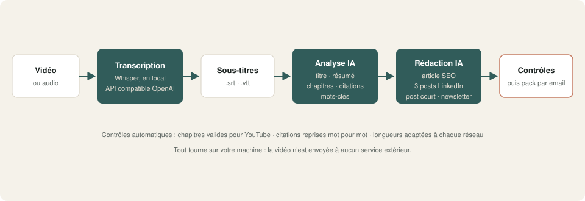
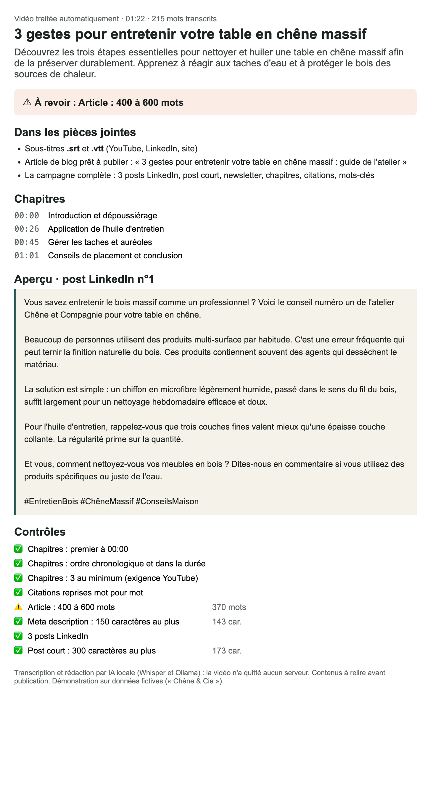

# 03 · Une vidéo → une campagne de contenus

Déposez une vidéo. Quelques minutes plus tard, vous recevez ses **sous-titres**, un **article de blog**, **3 posts LinkedIn**, un **post court**, une **newsletter**, les **chapitres YouTube**, des **citations** et des **mots-clés**. Transcription et rédaction tournent **en local**.

## Ce que fait le workflow

1. **Réception** d'une vidéo ou d'un audio (formulaire dans la démo), avec un contexte facultatif.
2. **Transcription horodatée** par Whisper, via `transcription_locale.py`, un petit service local compatible avec l'API d'OpenAI.
3. **Sous-titres** `.srt` et `.vtt`, prêts pour YouTube, LinkedIn ou votre site.
4. **Analyse par IA locale** (Ollama) : titre, résumé, chapitres, 3 citations, mots-clés.
5. **Rédaction** : article de blog de 400 à 600 mots avec meta description, 3 posts LinkedIn aux angles différents, post court pour Instagram ou Facebook, newsletter.
6. **Contrôles automatiques** :
   - chapitres valides pour YouTube (premier à 00:00, ordre, 3 au minimum) ;
   - citations **reprises mot pour mot** de la vidéo ;
   - longueurs adaptées à chaque format.
7. **Envoi du pack** par email : un récapitulatif et 4 pièces jointes (SRT, VTT, article, campagne complète).

## Résultat

L'email reçu par la communication :

Les fichiers réellement produits sur la vidéo de test sont dans [`exemple_resultat/`](exemple_resultat/), sans retouche.

## Testé

Sur une vidéo de démonstration de 88 secondes (tutoriel fictif « Trois gestes pour entretenir une table en chêne massif », voix de synthèse) :

| Étape | Résultat |
|---|---|
| Transcription (Whisper turbo) | 25 s, 19 segments, texte fidèle |
| Chapitres | 4 chapitres valides |
| Citations | 3 citations, toutes retrouvées mot pour mot |
| Article | 370 mots : signalé « à revoir » (cible 400 à 600) |
| Posts, newsletter | conformes aux longueurs demandées |
| Durée totale | **moins de 4 minutes** sur un Mac (Apple Silicon), modèle 27B |

**Ce qu'il faut relire, mesuré sur ce test :**
- Whisper confond parfois les homophones (« tâche » pour « tache »), et l'erreur se propage dans les textes.
- L'IA ajoute parfois une formule qui n'est pas dans la vidéo (« un héritage familial »).

Les contenus sont donc des **brouillons solides, à relire** avant publication ; l'email le rappelle.

## Prérequis

- **n8n 2.x** auto-hébergé.
- **Ollama** avec un modèle de chat : `qwen3.6` recommandé.
- **Transcription** au choix :
  - en local : `pip install openai-whisper` (ou `brew install openai-whisper`), **ffmpeg**, puis `python transcription_locale.py` ; le modèle `turbo` (1,5 Go) se télécharge au premier lancement ;
  - ou n'importe quelle API compatible OpenAI (OpenAI, Groq…) : changez l'URL du nœud *Transcrire* et ajoutez la clé.
- Un serveur **SMTP** (Mailpit suffit pour tester).

## Installation · environ 20 minutes

1. Lancer le service de transcription : `python transcription_locale.py` (il écoute sur `127.0.0.1:9000`).
2. Importer `demo.json` dans n8n.
3. Créer les identifiants `Ollama local` (API Ollama) et `SMTP Mailpit (démo)` (SMTP).
4. Vérifier l'URL du nœud **Transcrire (Whisper local)** : `http://host.docker.internal:9000/...` si n8n tourne dans Docker sur la même machine.
5. Retirer ou renseigner le workflow d'erreur dans les réglages, publier, ouvrir le formulaire et déposer `video_test/tuto_entretien_table_chene.mp4`.

## Limites de la démo

- Une vidéo à la fois, déposée à la main.
- Ton et vocabulaire génériques : rien n'est encore réglé sur votre marque.
- Rien n'est publié automatiquement : vous gardez la main.

## Version pro

La version complète ajoute :

- un dossier surveillé (Drive, Dropbox, NAS) ou un lien YouTube comme déclencheur ;
- un glossaire de votre métier pour corriger la transcription (noms propres, homophones) ;
- votre style de marque, appris sur vos anciens contenus ;
- les sous-titres incrustés et des extraits courts pour Reels et Shorts ;
- la publication programmée après validation ;
- un guide d'installation en français et une vidéo.

---

Démonstration sur données fictives (« Chêne & Cie »). Licence [PolyForm Noncommercial 1.0.0](../../LICENSE.md).
