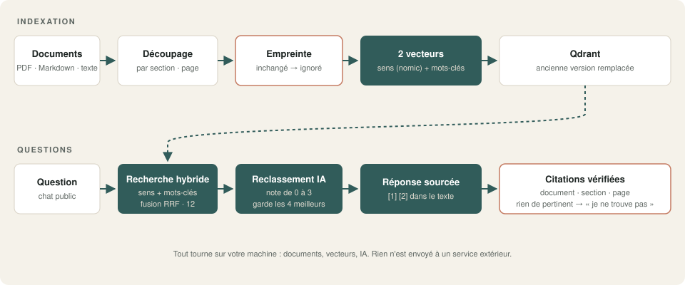
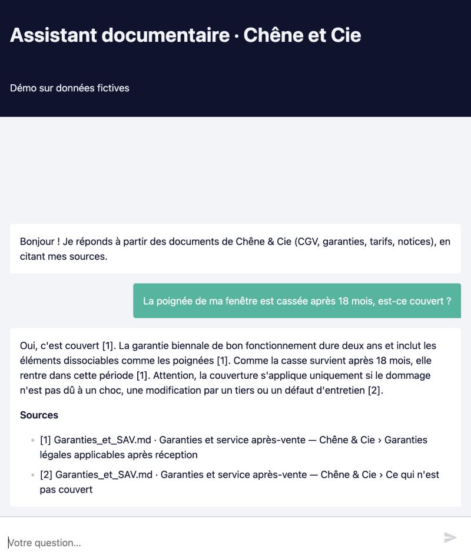
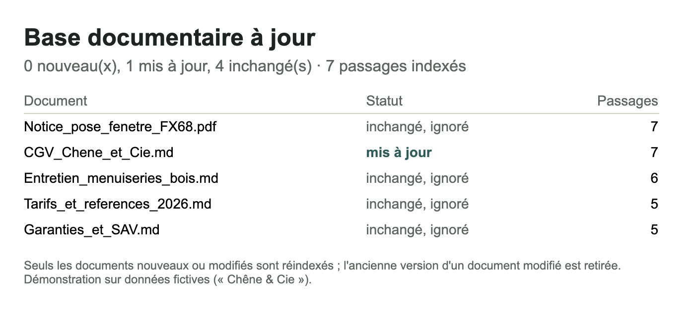

# 04 · Assistant documentaire avancé (RAG hybride)

Un assistant qui répond à partir de **vos** documents, **cite ses sources** (document, section, page) et dit « je ne trouve pas » plutôt que d'inventer. La base se **met à jour toute seule** : un document modifié remplace l'ancienne version, un document inchangé est ignoré. Tout tourne **en local**.

## Ce que fait le workflow

Un seul workflow, deux parties.

**Indexation** (formulaire de dépôt) :
1. Dépôt de PDF, Markdown ou textes, plusieurs à la fois.
2. **Découpage par section** : titres Markdown ou titres numérotés des PDF, avec le numéro de page ; 1 000 caractères au plus par passage.
3. **Empreinte** de chaque document : s'il est déjà indexé et inchangé, il est ignoré ; s'il a changé, l'ancienne version est retirée avant la nouvelle.
4. **Deux vecteurs par passage** :
   - le **sens**, calculé par `nomic-embed-text` via Ollama ;
   - les **mots-clés**, un vecteur BM25 dont Qdrant calcule la rareté des mots (IDF).
5. Rapport d'indexation par email.

**Questions** (chat public, intégrable sur un site) :
1. **Recherche hybride** dans Qdrant : sens et mots-clés, les deux classements fusionnés (RRF), 12 passages candidats.
2. **Reclassement** : l'IA locale note chaque passage de 0 à 3 ; seuls les passages notés 2 ou 3 sont gardés, 4 au plus.
3. Rien de pertinent : réponse « je ne trouve pas », **sans appeler l'IA de rédaction**.
4. **Réponse sourcée** : chaque information porte son numéro de source.
5. **Vérification des citations** : une référence qui ne correspond à aucune source est retirée ; la liste des sources citées est ajoutée en fin de réponse.

## Résultat

Après la mise à jour d'un document :

## Testé

Base de démonstration : 5 documents fictifs (CGV, garanties, fiche d'entretien, tarifs avec références, notice de pose en PDF), soit 30 passages.

| Question | Réponse | Source citée |
|---|---|---|
| Combien de temps un devis est-il valable ? | 3 mois, puis **2 mois après mise à jour des CGV** | CGV › 1. Devis |
| Prix de la référence ESC-QT-08 ? | 6 900 € TTC | Tarifs › Escaliers |
| 5 semaines de retard, puis-je annuler ? | Non : 30 jours après mise en demeure | CGV › 3. Délais |
| Couple de serrage des paumelles FX68 ? | 3,5 N.m, 4 N.m au plus | Notice PDF › 3. Réglage des paumelles · p. 1 |
| Poignée cassée après 18 mois, couvert ? | Oui, garantie biennale (2 ans), sauf choc ou usure | Garanties › légales + exclusions |
| Comment entretenir un escalier en chêne ? | Selon la finition : vitrifié ou huilé | Entretien › Escaliers en chêne |
| Êtes-vous ouverts le samedi ? | « Je ne trouve pas cette information… » | aucune, comme attendu |

**Mise à jour :** CGV modifiée renvoyée avec les 4 autres documents → 1 mis à jour, 4 ignorés, aucun doublon dans la base. Le même document renvoyé une seconde fois → ignoré.

**Durées mesurées** sur un Mac (Apple Silicon), modèle 27B :
- indexation : 1,8 s pour les 5 documents, 0,8 s pour une mise à jour ;
- question : 38 à 52 s ;
- « je ne trouve pas » : 17 à 26 s.

**Ce que la recherche hybride apporte ici, mesuré honnêtement :** sur cette petite base, la recherche par le sens trouve déjà seule les références exactes (ESC-QT-08, ENT-JOINT-10). Le gain apparaît sur les questions formulées autrement que le document. Pour « poignée cassée après 18 mois », le bon passage arrive 11ᵉ par le sens seul, 4ᵉ par les mots-clés et 6ᵉ en hybride. Avec 8 candidats, ce passage était manqué ; la démo en garde donc 12 pour le reclassement. Plus la base grandit, plus les mots-clés comptent.

## Prérequis

- **n8n 2.x** auto-hébergé.
- **Qdrant** 1.10 ou plus récent (vecteurs nommés, vecteurs creux avec IDF, API Query).
- **Ollama** avec `nomic-embed-text` (vecteurs) et un modèle de chat : `qwen3.6` recommandé.
- Un serveur **SMTP** pour le rapport d'indexation (Mailpit suffit pour tester).

## Installation · environ 20 minutes

1. Importer `demo.json` dans n8n.
2. Créer les identifiants `Ollama local` (API Ollama) et `SMTP Mailpit (démo)` (SMTP).
3. Vérifier les adresses de Qdrant et d'Ollama dans les nœuds HTTP : `http://host.docker.internal:6333` et `:11434` si n8n tourne dans Docker sur la même machine. Si Qdrant est protégé par une clé, ajouter l'en-tête `api-key`.
4. Retirer ou renseigner le workflow d'erreur dans les réglages, puis publier.
5. Ouvrir le formulaire et déposer les fichiers de `documents/`, puis poser une question dans le chat.
6. Pour tester la mise à jour, déposer `documents_mise_a_jour/CGV_Chene_et_Cie.md`.

La collection `demo_rag_avance` est créée automatiquement au premier dépôt.

## Limites de la démo

- `nomic-embed-text` est surtout entraîné sur l'anglais : correct en français, sans plus. Un modèle multilingue (`bge-m3`) améliore la recherche par le sens.
- Pas de mémoire de conversation : chaque question est traitée seule.
- PDF avec texte uniquement (pas de scans).
- Une seule base, sans droits d'accès par utilisateur.

## Version pro

La version complète ajoute :

- Google Drive, SharePoint ou un dossier surveillé comme source, avec synchronisation des suppressions ;
- un modèle de vecteurs multilingue et la reformulation des questions ;
- la mémoire de conversation ;
- les droits d'accès par service (RH, commercial, technique) ;
- les PDF scannés (lecture par IA avec vision) ;
- le suivi des questions sans réponse, pour savoir quel document écrire ;
- un guide d'installation en français et une vidéo.

---

Démonstration sur données fictives (« Chêne & Cie »). Licence [PolyForm Noncommercial 1.0.0](../../LICENSE.md).
