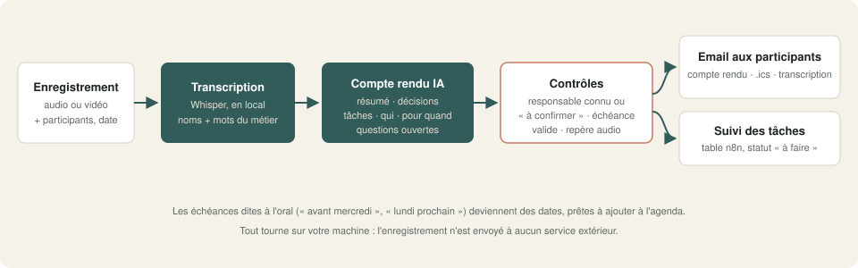
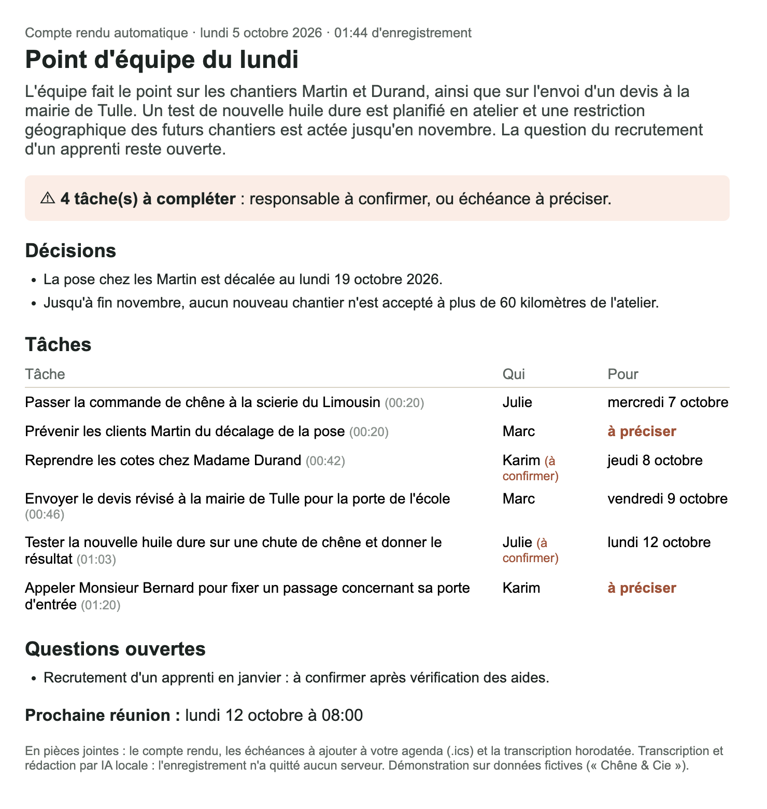

# 05 · Compte rendu de réunion automatique

Déposez l'enregistrement d'une réunion. Deux minutes plus tard, chaque participant reçoit le **compte rendu** : résumé, décisions, **tâches avec responsable et échéance**, questions ouvertes, prochaine réunion. Il reçoit aussi un **fichier agenda (.ics)** des échéances. Transcription et rédaction tournent **en local**.



## Ce que fait le workflow

1. **Réception** de l'enregistrement (audio ou vidéo : dictaphone, téléphone, export Teams, Zoom ou Meet), avec la date, les participants (nom, rôle, email) et, si besoin, des **mots du métier**.
2. **Transcription horodatée** par Whisper, via le service local `transcription_locale.py` (le même que le workflow n°3), compatible avec l'API d'OpenAI. Les noms des participants et les mots du métier lui sont donnés pour mieux les écrire.
3. **Rédaction par IA locale** (Ollama) :
   - résumé et décisions ;
   - tâches avec responsable, échéance et repère dans l'enregistrement ;
   - questions ouvertes et prochaine réunion.
   Les échéances dites à l'oral (« avant mercredi », « lundi prochain ») sont converties en dates à partir de la date de la réunion.
4. **Contrôles automatiques** :
   - le responsable fait partie des participants ;
   - une attribution **déduite** (personne n'a été nommé) est marquée « à confirmer » ;
   - l'échéance est une vraie date, postérieure à la réunion ;
   - le repère existe dans l'enregistrement.
5. **Email à tous les participants**, avec 3 pièces jointes : le compte rendu (Markdown), les échéances et la prochaine réunion (**.ics**, à ouvrir dans Outlook, Google Agenda ou Calendrier) et la transcription horodatée.
6. **Suivi** : chaque tâche est enregistrée dans une table n8n avec le statut « à faire ».

## Résultat



Les fichiers réellement produits sont dans [`exemple_resultat/`](exemple_resultat/), sans retouche.

## Testé

Sur une réunion fictive de 1 min 46 s à 3 voix (gérant, cheffe d'atelier, poseur ; voix de synthèse), avec 6 tâches dont 2 sans échéance, 2 décisions, 1 question ouverte et des échéances dites à l'oral :

| Élément | Attendu | Obtenu |
|---|---|---|
| Échéances (réunion du lundi 5 octobre) | mer. 7, jeu. 8, ven. 9, lun. 12 | ✓ toutes exactes |
| Décisions | pose décalée au 19 octobre ; pas de chantier à plus de 60 km | ✓ |
| Tâches sans échéance (« dès que possible ») | « à préciser » | ✓ les 2 signalées |
| Responsables | 6 tâches | ✓ 6 justes, dont 2 déduites, marquées « à confirmer » |
| Question ouverte | apprenti en janvier | ✓ |
| Prochaine réunion | lundi 12 octobre à 8 h | ✓, ajoutée au fichier .ics |

Durée totale mesurée : **1 min 35 s à 1 min 55 s** sur un Mac (Apple Silicon), modèle 27B.

**Ce qu'il faut savoir, mesuré sur ce test :**
- **Whisper ne distingue pas les voix.** Lors d'un premier essai, sans les rôles ni la mention « à confirmer », 2 tâches sur 6 étaient attribuées à la mauvaise personne. Avec les rôles des participants, les 6 sont justes. Les 2 attributions déduites restent marquées « à confirmer » : un humain valide d'un coup d'œil.
- **Les mots du métier comptent.** Sans eux, Whisper écrivait « Syrie » pour « scierie » et « codes » pour « cotes ». Avec eux, la transcription s'améliore et l'IA corrige le reste dans le compte rendu.

## Prérequis

- **n8n 2.x** auto-hébergé (une table n8n sert au suivi des tâches).
- **Ollama** avec un modèle de chat : `qwen3.6` recommandé.
- Le **service de transcription** du workflow n°3 (`../03-video-campagne/transcription_locale.py`), ou n'importe quelle API compatible OpenAI (OpenAI, Groq…).
- Un serveur **SMTP** (Mailpit suffit pour tester).

## Installation · environ 15 minutes

1. Lancer le service de transcription : `python ../03-video-campagne/transcription_locale.py`.
2. Importer `demo.json` dans n8n.
3. Créer les identifiants `Ollama local` (API Ollama) et `SMTP Mailpit (démo)` (SMTP).
4. Vérifier l'URL du nœud **Transcrire (Whisper local)** : `http://host.docker.internal:9000/...` si n8n tourne dans Docker sur la même machine.
5. Retirer ou renseigner le workflow d'erreur dans les réglages, puis publier.
6. Ouvrir le formulaire et déposer `audio_test/reunion_lundi_atelier.m4a`, avec :
   - date : 2026-10-05 ;
   - participants (une ligne chacun) :
     ```
     Marc Lefèvre, gérant, marc@chene-et-cie.demo
     Julie Moreau, cheffe d'atelier, julie@chene-et-cie.demo
     Karim Benali, poseur, karim@chene-et-cie.demo
     ```
   - mots du métier : `scierie, cotes, pose, quart tournant, écolabel, huile dure`.

## Limites de la démo

- Pas d'identification des voix : le responsable d'une tâche est déduit du contexte et des rôles.
- Enregistrement déposé à la main.
- Le suivi des tâches s'arrête à l'enregistrement : pas de relance.

## Version pro

La version complète ajoute :

- la récupération automatique des enregistrements Teams, Zoom ou Google Meet ;
- l'**identification des voix**, pour savoir qui a dit quoi ;
- les relances automatiques avant chaque échéance, et le point des tâches en retard au début de la réunion suivante ;
- l'envoi des tâches vers Trello, Notion, Asana ou Planner ;
- un glossaire du métier enregistré une fois pour toutes ;
- un guide d'installation en français et une vidéo.

---

Démonstration sur données fictives (« Chêne & Cie »). Licence [PolyForm Noncommercial 1.0.0](../../LICENSE.md).
