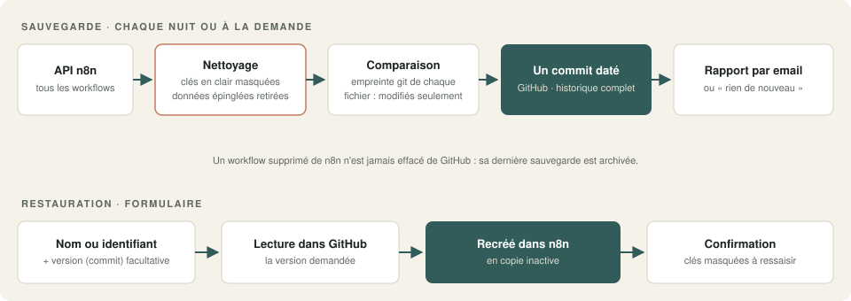
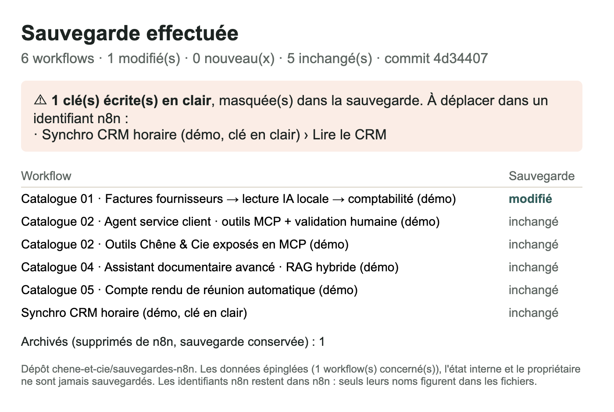

# 06 · Sauvegarde des workflows n8n dans GitHub

Chaque nuit, tous vos workflows n8n partent dans un dépôt GitHub, **en un seul commit daté**, avec seulement ce qui a changé. Les **clés écrites en clair sont masquées** et signalées, les données épinglées ne quittent pas n8n. Un formulaire **restaure** n'importe quelle version, en copie inactive.



## Ce que fait le workflow

**Sauvegarde** (chaque nuit à 2 h, ou à la demande avec une note) :
1. Lecture de tous les workflows par l'**API n8n**, page par page.
2. **Nettoyage** de chaque workflow :
   - retirés : données épinglées (souvent des données réelles de clients), état interne, propriétaire ;
   - **masqués** : les clés écrites en clair dans un nœud (formats OpenAI, GitHub, Slack, AWS, Google, jetons Bearer et JWT, champs « password », « token », « api_key »…), avec une alerte qui dit où.
3. **Comparaison** avec la dernière sauvegarde, par l'empreinte git de chaque fichier : seuls les workflows nouveaux ou modifiés partent.
4. **Un seul commit** pour toute la sauvegarde (API Git Data de GitHub), avec un message daté et la note facultative.
5. Un **index lisible** (`README.md` du dépôt) : la liste des workflows, les secrets masqués, les workflows archivés.
6. Un workflow supprimé de n8n n'est **jamais effacé** de GitHub : il passe dans la liste des archivés.
7. **Rapport par email** : ce qui a changé, ou « rien de nouveau ».

**Restauration** (formulaire) :
1. Un nom ou un identifiant de workflow, et une version (commit) facultative.
2. Le fichier est lu dans GitHub à cette version.
3. Le workflow est **recréé en copie inactive**, sans toucher à l'original.
4. L'email de confirmation rappelle les clés masquées à ressaisir.

## Résultat



L'historique obtenu pendant les tests ([`exemple_resultat/historique_git.txt`](exemple_resultat/historique_git.txt)) :

```
4d34407  Sauvegarde du 6 octobre 2026 à 08h50 : 1 modifié(s), 0 nouveau(x) · Avant mise à jour de n8n
9d68a41  Sauvegarde du 6 octobre 2026 à 08h49 : 1 modifié(s), 0 nouveau(x)
9c2dbae  Sauvegarde du 6 octobre 2026 à 08h48 : 0 modifié(s), 7 nouveau(x) · Première sauvegarde
```

## Testé

**Comment :** contre des **doubles locaux** des API n8n et GitHub ([`doubles_locaux.py`](doubles_locaux.py)), pour ne manipuler aucune vraie clé pendant les tests. Le double GitHub s'appuie sur un **vrai dépôt git** : les commits et les empreintes sont ceux que GitHub calculerait. L'instance de test contient les démos du catalogue et un workflow volontairement « sale » : clé API en clair, données d'un client épinglées, propriétaire.

| Scénario | Résultat |
|---|---|
| Première sauvegarde | ✓ 1 commit, 7 fichiers, index créé |
| Clé API écrite en clair | ✓ masquée, signalée dans l'email et dans l'index |
| Données épinglées, état interne, propriétaire | ✓ absents de toutes les sauvegardes |
| Un workflow modifié, un supprimé | ✓ commit limité à la ligne modifiée ; le supprimé archivé, pas effacé |
| Aucun changement | ✓ pas de commit, email « rien de nouveau » |
| Restauration par nom | ✓ copie inactive, rappel de la clé à ressaisir |
| Restauration par identifiant et ancienne version | ✓ la version d'origine revient (valeur modifiée depuis : bien l'ancienne) |
| Erreur pendant une restauration | ✓ remontée à la supervision par le workflow d'erreur |

Calcul des empreintes vérifié contre `git hash-object` (accents, fichiers de plusieurs blocs) : identique.

**Ce qu'il faut savoir :**
- Le contenu des nœuds est sauvegardé tel quel. Une adresse email écrite dans un nœud (un destinataire, par exemple) figure donc dans la sauvegarde. Utilisez un **dépôt privé**.
- Le masquage repose sur des formats de clés connus : une clé au format inhabituel peut passer. La bonne pratique reste de ranger toutes les clés dans les identifiants n8n.
- Un premier essai sur votre vraie instance, avec vos clés, prend 5 minutes et reste indispensable : il valide les droits de la clé GitHub.

## Prérequis

- **n8n 2.x** avec l'**API publique** activée, et une clé API (Paramètres › API n8n).
- Un **dépôt GitHub privé** contenant au moins un fichier, et un **jeton GitHub à granularité fine** limité à ce dépôt, avec la permission « Contents : lecture et écriture ».
- Un serveur **SMTP** pour les rapports.

## Installation · environ 15 minutes

1. Importer `demo.json` dans n8n.
2. Créer deux identifiants de type **Header Auth** :
   - `API n8n (démo)` : nom `X-N8N-API-KEY`, valeur = votre clé API n8n ;
   - `GitHub (démo)` : nom `Authorization`, valeur = `Bearer ` suivi de votre jeton GitHub.
3. Créer l'identifiant `SMTP Mailpit (démo)` (ou votre SMTP).
4. Ouvrir le nœud **Réglages** : adresse de votre n8n, dépôt `propriétaire/nom`, branche, dossier, destinataire du rapport.
5. Retirer ou renseigner le workflow d'erreur, publier, puis lancer « Sauvegarder maintenant ».

**Tester sans aucun compte :** `python doubles_locaux.py --donnees donnees_demo/instance_n8n.json --depot ./depot.git --cle-n8n test1 --cle-github test2` (régénérer les données avec `node preparer_donnees_demo.js`), puis importer `demo_test.json`, la même version pointée sur les doubles.

## Limites de la démo

- Une seule instance n8n et un seul dépôt.
- Les identifiants (clés, mots de passe) ne sont pas sauvegardés : seuls leurs noms le sont. C'est voulu, mais il faut les recréer après une perte de serveur.
- Pas de comparaison lisible entre deux versions dans l'email : l'historique est consultable dans GitHub.

## Version pro

La version complète ajoute :

- la sauvegarde **chiffrée** des identifiants, pour une reprise complète après une perte de serveur ;
- plusieurs instances (client par client) vers des dossiers ou dépôts séparés ;
- un résumé lisible des changements dans l'email (nœuds ajoutés, supprimés, modifiés) ;
- GitLab, Gitea ou un NAS comme destination ;
- l'alerte si la sauvegarde n'a pas tourné depuis 48 h ;
- un guide d'installation en français et une vidéo.

---

Démonstration sur données fictives (« Chêne & Cie »). Licence [PolyForm Noncommercial 1.0.0](../../LICENSE.md).
