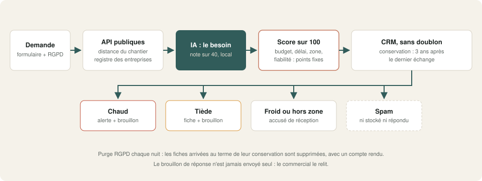
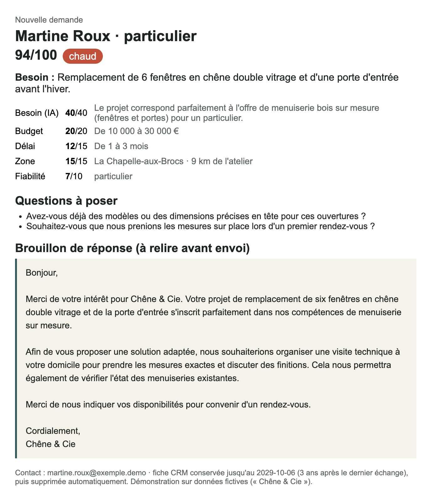
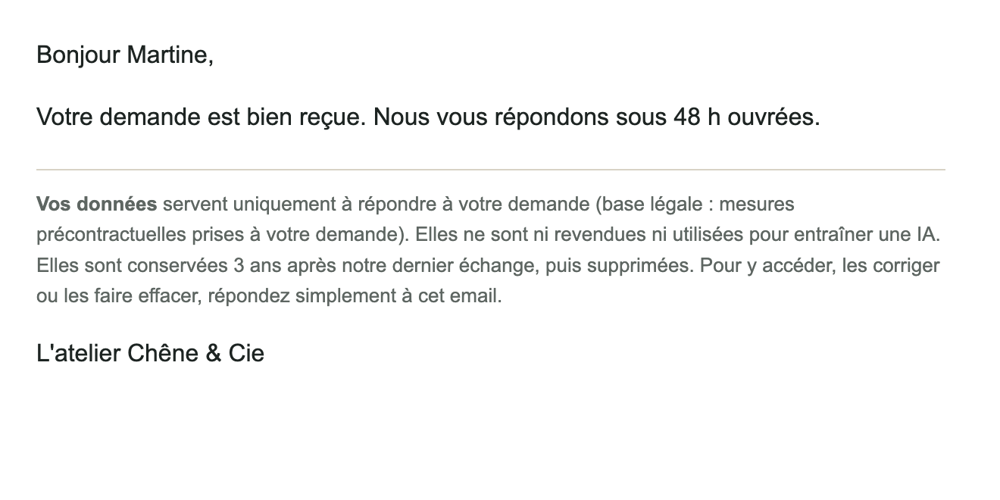

# 07 · Prospects : qualification IA → CRM (version française, RGPD)

Chaque demande de devis reçoit un **score sur 100 expliqué ligne par ligne**. Les bons prospects partent au commercial avec un **brouillon de réponse à relire**, le spam est écarté, les doublons fusionnés. Le fichier prospects se **purge tout seul** au bout de 3 ans, comme le recommande la CNIL.

Démo configurée pour un artisan (Chêne & Cie, menuiserie, zone de 60 km autour de Brive). L'offre, l'atelier et la zone se règlent dans le nœud **Réglages**.

## Ce que fait le workflow

**Réception d'une demande** (formulaire de devis) :
1. **Contrôles sans IA** : adresse email, code postal, SIREN (clé de Luhn), information RGPD acceptée.
2. **API publiques gratuites, sans clé** :
   - **geo.api.gouv.fr** : commune du chantier et distance à vol d'oiseau jusqu'à l'atelier ;
   - pour un professionnel, **recherche-entreprises.api.gouv.fr** : entreprise trouvée, active ou cessée, effectif, activité. **Les dirigeants ne sont jamais récupérés.**
3. **L'IA ne note que le besoin** (sur 40) et rédige un résumé, 2 questions à poser et un brouillon de réponse. Elle repère aussi le spam.
4. **Le reste est en points fixes**, donc vérifiable : budget (20), délai (15), zone (15), fiabilité (10). Score sur 100, détaillé dans la fiche.
5. **Catégorie** : chaud (70 et plus), tiède (40 à 69), froid, **hors zone** (au-delà d'une fois et demie la zone), spam.
6. **CRM sans doublon** : un prospect déjà connu est mis à jour, avec son nombre de demandes.
7. **Suite** :
   - chaud : alerte au commercial, « à rappeler aujourd'hui » ;
   - tiède : fiche au commercial ;
   - froid ou hors zone : accusé de réception seulement ;
   - spam : **ni enregistré, ni répondu**.
   
   Tout prospect légitime reçoit un accusé de réception avec l'**information RGPD** (finalité, base légale, durée, droits).

**Purge RGPD** (chaque nuit à 3 h, ou à la demande) :
- suppression des fiches dont la conservation (3 ans après le dernier échange) est dépassée ;
- un **mode simulation** qui liste sans rien effacer ;
- un compte rendu par email, qui sert de trace pour le registre des traitements.

## Résultat

La fiche reçue par le commercial :

L'accusé de réception reçu par le prospect :

## Testé

7 demandes fictives, puis la purge :

| Demande | Score | Résultat |
|---|---|---|
| Particulier à 9 km : 6 fenêtres et une porte, 10 à 30 k€, 1 à 3 mois | 94 | ✓ chaud : alerte au commercial + accusé |
| Particulier à 82 km : escalier « on se renseigne » | 61 | ✓ tiède : fiche au commercial + accusé |
| Demande de stage | 35 | ✓ froid : accusé seulement |
| Professionnel à Lyon (268 km), gros chantier | 76 | ✓ **hors zone** malgré le score : accusé seulement |
| Démarchage « backlinks » en anglais | — | ✓ spam : rien enregistré, rien envoyé |
| Test du registre (SIREN public de l'INSEE, demande fictive) | 23 | ✓ entreprise « vérifiée, active » ; hors zone |
| Même prospect, deuxième demande | 94 | ✓ fiche mise à jour, 2 demandes, pas de doublon |

| Purge | Résultat |
|---|---|
| Purge réelle à la date du jour | ✓ 0 fiche supprimée |
| Simulation au 8 octobre 2029 | ✓ 5 fiches listées, aucune effacée |
| Purge réelle au 8 octobre 2029 (version de test) | ✓ 5 fiches supprimées, table vide |

Durée mesurée : **moins de 40 secondes** par demande sur un Mac (Apple Silicon), modèle 27B.

**Ce qu'il faut savoir :**
- La distance est calculée au **centre de la commune**. Pour un code postal à plusieurs communes, c'est la première de la liste : quelques kilomètres d'écart possibles.
- Les barèmes (budget, délai, zone, fiabilité) sont des **choix**, à régler selon votre métier : ils sont écrits en clair dans le nœud « Score et dédoublonnage ».
- La durée de 3 ans suit la recommandation de la CNIL pour les prospects : à adapter si votre situation est différente.

## Prérequis

- **n8n 2.x** auto-hébergé (une table n8n sert de CRM dans la démo).
- **Ollama** avec un modèle de chat : `qwen3.6` recommandé.
- Un accès internet vers les deux API publiques (gratuites, sans compte).
- Un serveur **SMTP** (Mailpit suffit pour tester).

## Installation · environ 15 minutes

1. Importer `demo.json` dans n8n.
2. Créer les identifiants `Ollama local` (API Ollama) et `SMTP Mailpit (démo)` (SMTP).
3. Ouvrir **Réglages** : votre offre en une phrase, le code postal et les coordonnées de l'atelier, la zone en km, l'email du commercial.
4. Retirer ou renseigner le workflow d'erreur, publier, puis remplir le formulaire de devis.

`demo_test.json` est une version de test : la date de référence de la purge s'y applique aussi hors simulation, pour vérifier la suppression réelle. **Ne pas l'utiliser en production.**

## Limites de la démo

- Le CRM est une table n8n.
- Pas de relance automatique des prospects tièdes.
- Les demandes de droits RGPD (accès, effacement) se font par réponse à l'email : voir le workflow n°8.

## Version pro

La version complète ajoute :

- l'envoi vers HubSpot, Pipedrive, Axonaut, Sellsy ou un Google Sheet ;
- une séquence de relance des tièdes, arrêtée dès qu'ils répondent ;
- la tenue du registre des traitements ;
- le calcul de distance par la route ;
- la détection des demandes en double sous plusieurs adresses ;
- un guide d'installation en français et une vidéo.

---

Démonstration sur données fictives (« Chêne & Cie »). Les deux API utilisées sont des services publics français ouverts. Licence [PolyForm Noncommercial 1.0.0](../../LICENSE.md).
