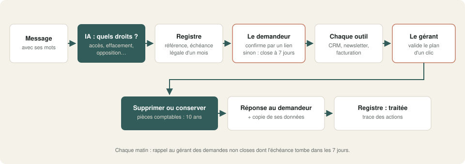
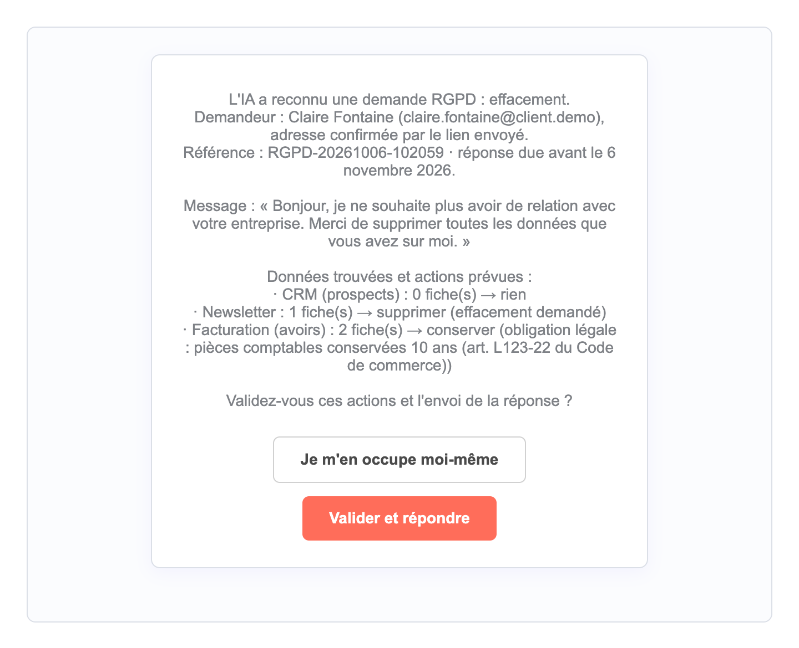
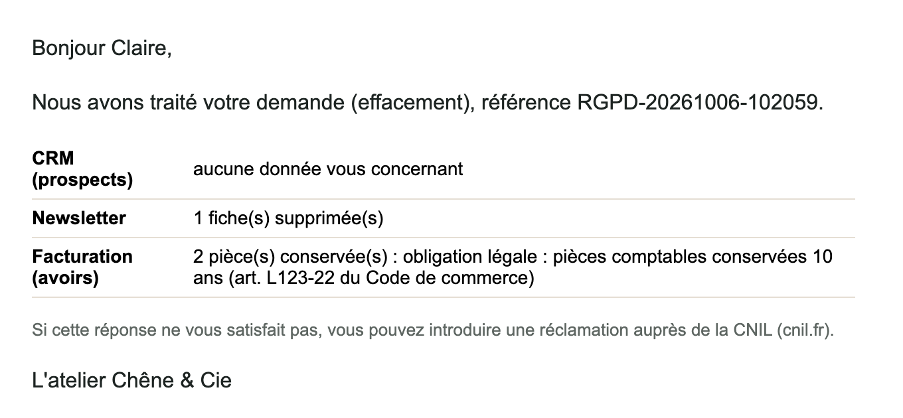

# 08 · Demandes RGPD automatisées

Une personne écrit « supprimez mes données » ou « que savez-vous sur moi ? ». Le workflow reconnaît le droit exercé et vérifie qu'elle est bien titulaire de l'adresse. Il cherche ses données **dans chaque outil**, **conserve ce que la loi impose de garder**, fait valider le plan par le gérant, exécute, répond et **tient le registre**, avec rappel avant l'échéance légale d'un mois.

## Ce que fait le workflow

1. **Réception** d'une demande rédigée librement (formulaire « Vos données personnelles »).
2. **IA locale** : demande RGPD ou non, et quels droits (accès, rectification, effacement, opposition, portabilité, limitation ; plusieurs possibles). Un message sans demande RGPD part au service client, **sans inscription au registre**.
3. **Registre** : référence, date, **échéance légale d'un mois** (article 12.3 du RGPD).
4. **Vérification** : un lien de confirmation part à l'adresse du demandeur. Sans clic sous 7 jours, la demande est close, sans aucune action.
5. **Recherche dans chaque outil** (ici : CRM des prospects, newsletter, facturation).
6. **Plan d'actions** selon les droits :
   - effacement ou opposition : supprimer du CRM et de la newsletter ;
   - effacement en facturation : **conserver**, avec le motif (pièces comptables, 10 ans, article L123-22 du Code de commerce) ;
   - accès ou portabilité : **copie des données en JSON** jointe à la réponse, préparée **avant** toute suppression ;
   - rectification ou limitation : signalée au gérant, à faire à la main.
7. **Le gérant valide** d'un clic (« Valider et répondre »), ou reprend la main (« Je m'en occupe moi-même »).
8. **Exécution**, réponse au demandeur (gérant en copie) avec la mention du droit de réclamation auprès de la CNIL, registre « traitée » avec le détail des actions.
9. **Chaque matin** : rappel des demandes non closes dont l'échéance tombe dans les 7 jours.

## Résultat

Le plan soumis au gérant :

La réponse reçue par la personne :

Une copie de données envoyée pour une demande d'accès : [`exemple_resultat/copie_des_donnees_acces.json`](exemple_resultat/copie_des_donnees_acces.json).

## Testé

Sur des données fictives réparties dans 3 outils (le CRM du workflow n°7, une newsletter, les avoirs du workflow n°2) :

| Demande | Résultat |
|---|---|
| « Supprimez toutes mes données » | ✓ effacement reconnu ; newsletter supprimée ; **2 avoirs conservés** avec le motif légal ; réponse et registre « traitée » |
| « Quelles informations avez-vous ? Une copie. Plus de newsletter ni d'offres » | ✓ accès et opposition reconnus ; copie JSON jointe, préparée avant la suppression ; CRM et newsletter supprimés |
| « Quand passez-vous prendre les mesures ? » | ✓ pas une demande RGPD : transmis au service client, pas de registre |
| Demande jamais confirmée par le demandeur | ✓ close sans aucune action (délai réduit à 1 minute dans la version de test) |
| Rectification d'un nom et désinscription ; le gérant reprend la main | ✓ registre « en cours : traitée à la main », rien d'exécuté |
| Rappel au 2 novembre | ✓ les 2 demandes non closes signalées, « reste 4 jours » |

Durée de la reconnaissance par l'IA : **4 à 12 secondes** par message, sur un Mac (Apple Silicon), modèle 27B. Le reste dépend des clics du demandeur et du gérant.

**Ce qu'il faut savoir :**
- Dans la démo, la facturation est cherchée **par nom**, les autres outils par email. Une homonymie est possible : le gérant voit le nombre de fiches trouvées avant de valider.
- Le workflow ne remplace pas votre analyse juridique : les durées de conservation et les motifs se règlent selon votre activité.
- La vérification par lien suffit quand la demande vient de l'adresse connue. Pour une demande sensible (données de santé, par exemple), une vérification renforcée peut être nécessaire.

## Prérequis

- **n8n 2.x** auto-hébergé (tables n8n pour la démo).
- **Ollama** avec un modèle de chat : `qwen3.6` recommandé.
- Un serveur **SMTP** joignable, et l'URL publique de n8n bien réglée (`WEBHOOK_URL`) : les boutons des emails y renvoient.

## Installation · environ 20 minutes

1. Importer `demo.json` dans n8n.
2. Créer les identifiants `Ollama local` (API Ollama) et `SMTP Mailpit (démo)` (SMTP).
3. Lancer une fois le formulaire « Préparer les données de démonstration » (newsletter fictive). Pour un test complet, faire tourner aussi les démos n°2 et n°7, qui remplissent les deux autres outils.
4. Retirer ou renseigner le workflow d'erreur, publier, puis remplir le formulaire « Vos données personnelles ».

`demo_test.json` : délai de confirmation d'une minute et vérification des échéances à une date choisie, pour les tests. **Ne pas l'utiliser en production.**

## Limites de la démo

- Les « outils » sont des tables n8n.
- Pas de déclencheur par email : les demandes arrivent par le formulaire.
- La rectification reste manuelle.

## Version pro

La version complète ajoute :

- la boîte mail comme déclencheur (réponses à vos emails, adresse dédiée) ;
- les vrais outils : HubSpot, Pipedrive, Brevo, Mailchimp, Pennylane, Google Sheets, sauvegardes ;
- la rectification assistée, champ par champ ;
- un export PDF lisible en plus du JSON ;
- un tableau de bord du registre pour un contrôle de la CNIL ;
- un guide d'installation en français et une vidéo.

---

Démonstration sur données fictives (« Chêne & Cie »). Ce workflow est un outil d'organisation, pas un conseil juridique. Licence [PolyForm Noncommercial 1.0.0](../../LICENSE.md).
