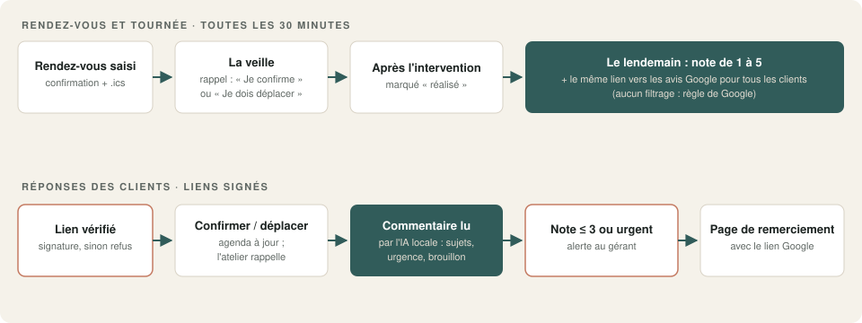
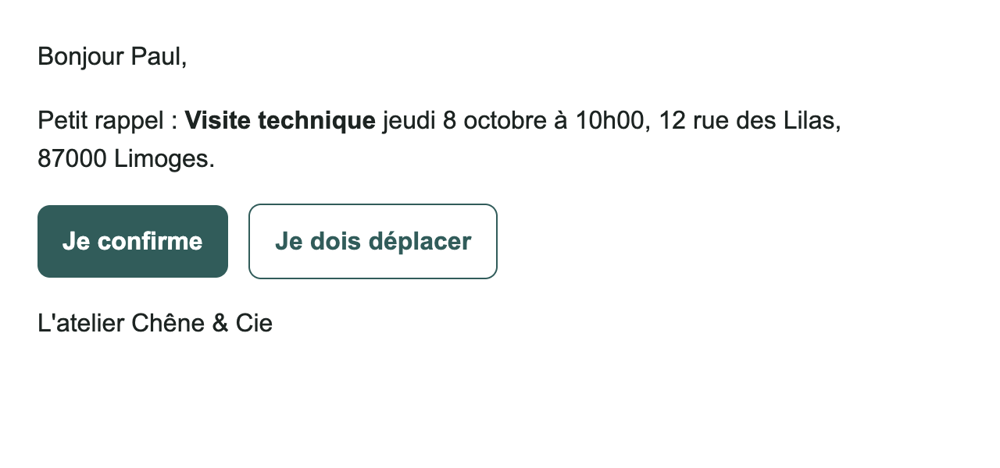
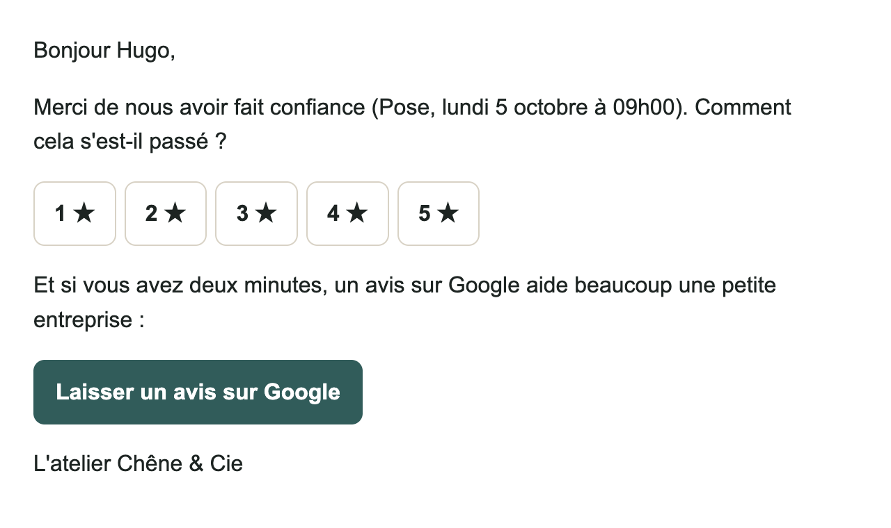
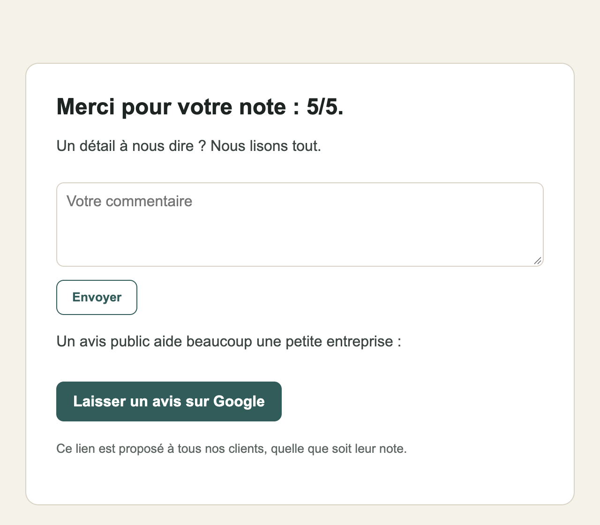
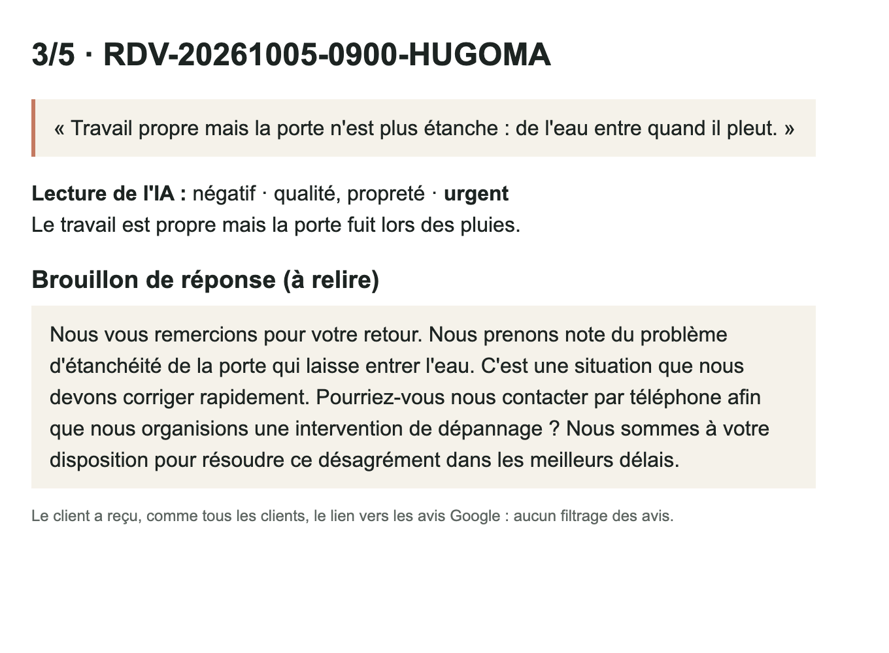

# 09 · Rappels de rendez-vous + demande d'avis Google

Moins de rendez-vous oubliés, plus d'avis Google, et aucun client mécontent qui passe inaperçu. Le client reçoit une confirmation avec le fichier agenda, un **rappel la veille** (« Je confirme » ou « Je dois déplacer »), puis le lendemain une **demande de note et d'avis**. Une note basse ou un commentaire inquiétant **alerte le gérant**, avec la lecture de l'IA et un brouillon de réponse.

**Conforme aux règles de Google :** le lien vers les avis est proposé à **tous** les clients, quelle que soit leur note. Beaucoup d'outils n'envoient vers Google que les clients satisfaits (« review gating ») : c'est interdit par Google et peut entraîner la suppression d'avis.

## Ce que font les deux workflows

**`demo.json` · Rendez-vous et tournée**
1. L'atelier saisit le rendez-vous (formulaire interne). Le client reçoit la confirmation et le **fichier agenda (.ics)**, avec une alarme 2 h avant.
2. **Toutes les 30 minutes**, une tournée décide pour chaque rendez-vous :
   - entre 24 h et 2 h avant : **rappel** avec deux boutons ;
   - rendez-vous terminé : « réalisé » ;
   - 18 h après la fin, soit le lendemain : **demande de note** (1 à 5 étoiles) et **lien vers les avis Google**.
   
   Un rendez-vous « à déplacer » sort de la tournée.

**`demo_reponses.json` · Réponses des clients** (les boutons des emails)
- **Liens signés** : chaque lien porte une signature calculée avec une clé secrète. Un lien modifié (autre rendez-vous, autre action) est refusé.
- « Je confirme » : agenda à jour, page de remerciement.
- « Je dois déplacer » : l'atelier est prévenu pour rappeler le client.
- Note : enregistrée, puis page de remerciement qui propose un commentaire et **le lien Google, pour tout le monde**.
- Commentaire : lu par l'**IA locale** (sentiment, sujets, urgence, brouillon de réponse). Note de 3 ou moins, commentaire négatif ou urgent : **alerte au gérant**.

Les deux workflows sont séparés parce que n8n n'accepte pas un formulaire et des réponses web dans le même workflow. Ils partagent la même clé, réglée dans leur nœud **Réglages**.

## Résultat

Le rappel de la veille :

La demande d'avis du lendemain :

La page après la note (le lien Google est proposé quelle que soit la note) :

L'alerte au gérant pour un commentaire inquiétant :

## Testé

5 rendez-vous fictifs, des tournées à des heures simulées et les clics des clients :

| Scénario | Résultat |
|---|---|
| Saisie d'un rendez-vous | ✓ confirmation et fichier .ics (heure de Paris, alarme 2 h avant) |
| Tournée du 7 octobre à 11 h | ✓ rappels pour les rendez-vous du jour à 14 h et du lendemain à 10 h ; demande d'avis pour l'intervention de la veille ; rien pour celui du 9 |
| « Je confirme » | ✓ statut « confirmé », page de remerciement |
| « Je dois déplacer » | ✓ atelier prévenu, rendez-vous sorti de la tournée |
| Lien modifié à la main | ✓ refusé (403), rien de modifié |
| Note 5/5 | ✓ pas d'alerte ; lien Google proposé |
| Note 2/5 : retard, sciure, porte qui frotte | ✓ alerte ; IA : négatif · retard, propreté, qualité ; brouillon de réponse |
| Note 3/5 : « de l'eau entre quand il pleut » | ✓ alerte **urgente** |
| Tournées des 8 et 9 octobre | ✓ rappel du rendez-vous du 9 ; demande d'avis le lendemain de la visite du 8 |

Durée : moins d'une seconde par tournée ; **20 secondes au plus** quand l'IA lit un commentaire (Mac Apple Silicon, modèle 27B).

**Ce qu'il faut savoir :**
- Les sujets proposés par l'IA sont indicatifs : sur « travail propre mais la porte n'est plus étanche », elle a ajouté « propreté ». L'alerte, elle, était juste (urgent).
- Changez la clé des liens (`cle_liens`) avant la mise en service, et mettez la même dans les deux workflows.
- Les rappels sont des messages liés au service rendu. Un envoi marketing (promotions) demanderait un consentement à part.

## Prérequis

- **n8n 2.x** auto-hébergé, accessible depuis internet pour que les clients puissent cliquer (`WEBHOOK_URL` réglé).
- **Ollama** avec un modèle de chat : `qwen3.6` recommandé.
- Un serveur **SMTP**.
- Le lien de votre fiche Google pour les avis (« Demander des avis » dans votre fiche d'établissement Google).

## Installation · environ 20 minutes

1. Importer `demo.json` et `demo_reponses.json` dans n8n.
2. Créer les identifiants `Ollama local` (API Ollama) et `SMTP Mailpit (démo)` (SMTP).
3. Dans les **deux** nœuds **Réglages** : nom de l'entreprise, adresse publique de n8n, **la même clé secrète**, lien des avis Google, emails de l'atelier et du gérant.
4. Retirer ou renseigner le workflow d'erreur, publier les deux workflows, puis saisir un rendez-vous.

`demo_test.json` (avec `demo_test_reponses.json`) ajoute un formulaire pour lancer la tournée à une heure choisie, utile pour les tests. **Ne pas l'utiliser en production.**

## Limites de la démo

- L'agenda est une table n8n.
- Rappels et demandes d'avis par email seulement.
- Pas de relance si le client ne répond pas au rappel.

## Version pro

La version complète ajoute :

- Google Agenda, Outlook ou Calendly comme agenda ;
- le **SMS** pour les rappels (Brevo, Twilio, OVH) ;
- la relance de dernière minute sans confirmation ;
- le tableau de bord mensuel des notes et des avis ;
- la réponse aux avis Google préparée par l'IA, à valider ;
- un guide d'installation en français et une vidéo.

---

Démonstration sur données fictives (« Chêne & Cie »). Licence [PolyForm Noncommercial 1.0.0](../../LICENSE.md).
