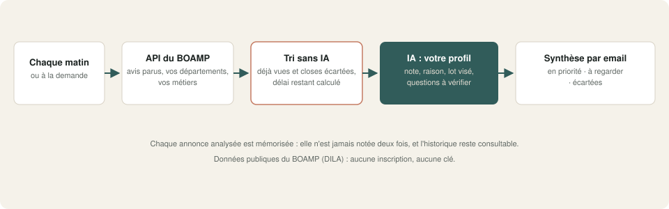
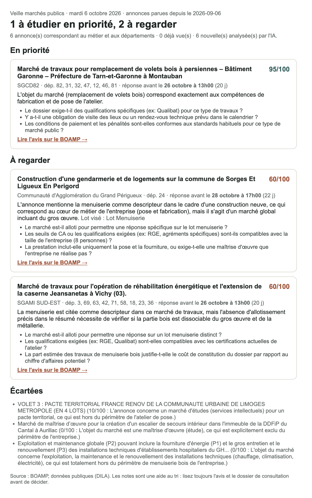

# 10 · Veille des appels d'offres publics (BOAMP) avec tri par IA

Chaque matin, les avis de marché parus au BOAMP dans vos départements et sur vos métiers sont **lus et notés par une IA locale selon le profil de votre entreprise**. Vous recevez une synthèse triée : en priorité, à regarder, écartées. Pour chaque annonce : la raison, le lot visé et les questions à vérifier dans le dossier.

Démo configurée pour un atelier de menuiserie bois de 8 personnes en Corrèze et dans les départements voisins. Profil, départements et métiers se règlent dans le nœud **Réglages**.

## Ce que fait le workflow

1. **Chaque matin à 7 h** (jours ouvrés), ou à la demande avec une période au choix.
2. **Requête à l'API publique du BOAMP**, sans compte ni clé : avis de marché parus depuis la veille, dans vos départements, avec vos descripteurs (« Menuiserie », « Bois »…) ou vos mots-clés dans l'objet.
3. **Tri sans IA** : annonces déjà vues et annonces closes écartées, délai restant calculé, nombre d'annonces analysées plafonné par jour.
4. **L'IA locale lit chaque annonce avec votre profil** :
   - note de 0 à 100 ;
   - recommandation (répondre, étudier, ignorer) et raison en une phrase ;
   - lot probablement visé ;
   - jusqu'à 3 points à vérifier dans le dossier de consultation.
   
   Un délai plus court que votre minimum est signalé, par une règle fixe.
5. **Mémoire** : chaque annonce analysée est enregistrée et ne sera plus jamais notée.
6. **Synthèse par email**, triée par note, avec le lien vers chaque avis. Pas de nouvelle annonce : pas d'email.

## Résultat

## Testé

Sur les **vraies annonces du BOAMP** parues entre le 6 septembre et le 6 octobre 2026 (6 annonces correspondant aux départements et aux métiers) :

| Annonce | Note | Lecture de l'IA |
|---|---|---|
| Remplacement de volets bois à persiennes (préfecture) | 95 | ✓ cœur de métier : à étudier en priorité |
| Construction d'une gendarmerie et de logements | 60 | ✓ lot menuiserie probable ; « le marché est-il alloti ? » |
| Réhabilitation et extension d'une caserne | 60 | ✓ à vérifier : partie bois dissociable ? |
| Pacte territorial de rénovation (études) | 10 | ✓ écartée : prestation intellectuelle |
| Maîtrise d'œuvre pour un escalier de secours | 0 | ✓ écartée : maîtrise d'œuvre, exclue du profil |
| Exploitation et maintenance d'installations hospitalières | 0 | ✓ écartée : hors métier |

| Scénario | Résultat |
|---|---|
| Première veille sur 30 jours | ✓ 6 annonces notées, synthèse envoyée en **1 min 37 s** |
| Deuxième passage | ✓ 6 annonces reconnues comme déjà vues, aucune analyse, aucun email, **0,6 s** |

**Ce qu'il faut savoir :**
- Le filtre par département porte sur **tous** les départements cités dans l'avis. Une annonce peut donc concerner un chantier éloigné : la caserne de Vichy remonte parce que son avis cite aussi la Creuse. La note de l'IA ne tient pas compte de la distance.
- L'IA ne lit que le résumé de l'avis, pas le dossier de consultation : ses questions servent à ouvrir le dossier au bon endroit, pas à décider à votre place.
- La règle « délai court » n'a pas été déclenchée par les annonces du jour : toutes laissaient au moins 20 jours.

## Prérequis

- **n8n 2.x** auto-hébergé (une table n8n sert de mémoire).
- **Ollama** avec un modèle de chat : `qwen3.6` recommandé.
- Un accès internet vers l'API du BOAMP (`boamp-datadila.opendatasoft.com`, publique).
- Un serveur **SMTP**.

## Installation · environ 15 minutes

1. Importer `demo.json` dans n8n.
2. Créer les identifiants `Ollama local` (API Ollama) et `SMTP Mailpit (démo)` (SMTP).
3. Ouvrir **Réglages** :
   - votre profil en quelques phrases (ce que vous faites, ce que vous ne faites pas, votre taille) ;
   - vos départements, vos descripteurs BOAMP et vos mots-clés ;
   - le délai minimum et le destinataire.
4. Retirer ou renseigner le workflow d'erreur, publier, puis lancer une première veille sur 30 jours.

## Limites de la démo

- Avis de marché du BOAMP seulement (pas les avis d'attribution ni les plateformes privées).
- Pas de lecture du dossier de consultation.
- Pas de calcul de distance au chantier.

## Version pro

La version complète ajoute :

- la **lecture du dossier de consultation** (règlement, CCTP) : allotissement, qualifications exigées, visite obligatoire, critères de notation ;
- la distance au lieu d'exécution ;
- l'historique des attributions de l'acheteur (prix et titulaires précédents) ;
- le suivi de chaque marché étudié jusqu'à la remise de l'offre, avec rappels ;
- les marchés européens (TED) ;
- un guide d'installation en français et une vidéo.

---

Données publiques du BOAMP (DILA), réutilisées selon la licence ouverte. Profil d'entreprise fictif (« Chêne & Cie »). Licence [PolyForm Noncommercial 1.0.0](../../LICENSE.md).
